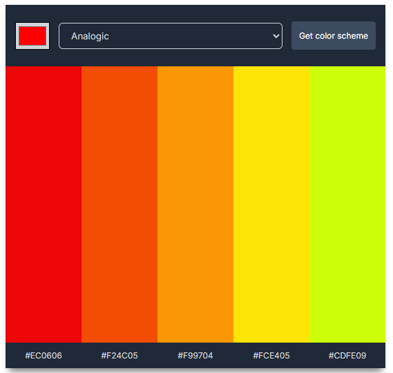

# Color Scheme Generator

A web application that generates color schemes based on user selected colors and modes, using The Color API.

[Live Demo](https://sweet-biscotti-70d7de.netlify.app/)



## About

This project was created as part of The Frontend Developer Career Path at Scrimba. It demonstrates how to fetch data from an external API and dynamically update the DOM based on the response.

## Features

- Select a base color using a color picker
- Choose from 7 different color scheme modes:
  - Monochrome
  - Monochrome-dark
  - Monochrome-light
  - Analogic
  - Complement
  - Analogic-complement
  - Triad
- Generate a 5-color scheme based on your selections
- Click on any color or hex code to copy it to clipboard
- Visual notification when a color is copied

## Technologies

- HTML5
- CSS3
- JavaScript (ES6+)
- Fetch API
- The Color API ([thecolorapi.com](https://www.thecolorapi.com/))
- Clipboard API
- Google Fonts (Inter)

## How it works

1. Select a base color using the color picker
2. Choose a color scheme mode from the dropdown
3. Click "Get color scheme" to generate a new palette
4. Click on any color or hex code to copy it to your clipboard
5. A notification will confirm that the color has been copied

## API Integration

The application uses fetch API to interact with The Color API:

```javascript
fetch(`https://www.thecolorapi.com/scheme?hex=${colorHex}&mode=${colorMode}&count=5`)
  .then(response => response.json())
  .then(data => renderColorScheme(data))
```

This retrieves a color scheme based on:
- A base color in hex format
- A color mode selection
- A count of 5 colors to generate

## User Experience Features

- Responsive design that works well on various screen sizes
- Hover effects for interactive elements
- Visual feedback when copying colors
- Clean and intuitive user interface

## Running the project

Clone the repository and open `index.html` in your browser:

```bash
git clone https://github.com/phattp/color-scheme-generator.git
cd color-scheme-generator
```

No additional setup or API keys are required.

## What I learned

- Working with external APIs using the Fetch API
- Handling API responses and updating the DOM
- Using the Clipboard API to copy text to clipboard
- Creating visual notifications for user actions
- Dynamically positioning elements based on viewport calculations
- Color theory and the different types of color schemes

---

Created by [Phatthara Pisootrapee](https://github.com/phattp) | [The Frontend Developer Career Path at Scrimba](https://scrimba.com/learn/frontend)
